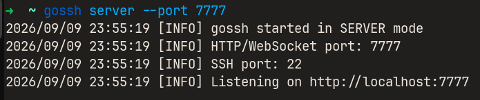
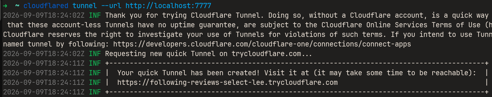

# gossh [](https://github.com/ankushT369/gossh/actions?query=workflow%3AC)

**gossh Lightweight SSH-over-HTTPS proxy for secure and firewall-friendly remote access**

<p align="center">
  
</p>


gossh is a lightweight tool that enables SSH access over secure WebSocket (WSS) connections. It allows you to connect to remote machines even when direct SSH traffic (port 22) is blocked, by tunneling it through standard HTTPS infrastructure.

In many environments — such as corporate networks, cloud platforms, or public Wi-Fi — only HTTP/HTTPS traffic is allowed. gossh works by upgrading HTTP connections to WebSockets and streaming SSH data through them, enabling real-time, bidirectional communication without modifying the existing SSH server.

Instead of acting as a traditional HTTP proxy, gossh creates a persistent tunnel:

* The client exposes a local TCP port for SSH
* Data is forwarded over a secure WebSocket (WSS) connection
* The server bridges this to the local SSH daemon (`sshd`)
* Responses are streamed back instantly

This makes gossh behave like a raw TCP tunnel over WebSocket (WSS) using HTTPS infrastructure.

gossh is:

* **Lightweight** — minimal dependencies
* **Real-time** — full-duplex streaming
* **Firewall-friendly** — runs over HTTPS (port 443)
* **Transparent** — works with standard SSH clients

It does not replace SSH or require changes to the SSH server—only provides a flexible transport layer on top.

## How to use
### 0. Install
```bash
curl -fsSL https://raw.githubusercontent.com/ankushT369/gossh/main/install.sh | bash
```

###  1. Start gossh Server

Run the gossh server on your machine (where `sshd` is running):

```bash
gossh server --port 7777
```

<p align="center">
  
</p>


> NOTE: Make sure SSH is running on port 22 (or specify using `--ssh`)


###  2. Expose Server using ngrok or cloudflare tunnel

Since gossh uses WebSockets over HTTP, you can expose it using ngrok:

```bash
ngrok http 7777
```

or 
```bash
cloudflared tunnel --url http://localhost:7777
```

<p align="center">
  
</p>

**Copy the generated *HTTPS URL* (e.g., `https://xxxxx.ngrok-free.dev`)**


###  3. Start gossh Client

On the client machine, connect to the server using the ngrok URL:

```bash
gossh client \
  --connect https://your-ngrok-url.ngrok-free.dev \
  --port 8888
```

**This creates a local TCP port (`8888`) for SSH access**


###  4. Connect via SSH

Now use standard SSH to connect:

```bash
ssh ankush@localhost -p 8888
```
<p align="center">
  
</p>

**You are now connected to the remote machine through gossh!**


### Flow Summary

```text
SSH Client (localhost:8888)
        ↓
gossh Client
        ↓ (WSS over HTTPS via ngrok)
gossh Server
        ↓
sshd (localhost:22)
```


#### Notes
* ngrok is used only to expose the server publicly
* gossh itself handles the tunneling over WebSocket (WSS)
* Works in restricted networks where only HTTPS (port 443) is allowed


## Build
> Note: The project is in its inital phase recommended to build for linux amd64 or WSL
```bash
make
```

Output:

```
bin/gossh
```


## Contribution
Everyone is welcome to contribute if you want to learn low-level network programming this can be helpful. Please make a different branch before any pull request.
